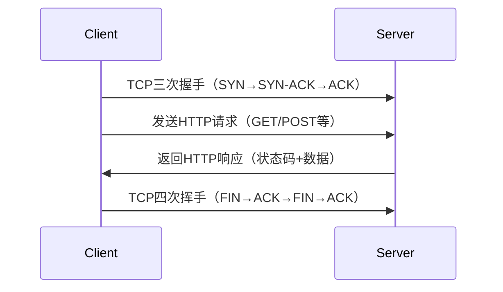
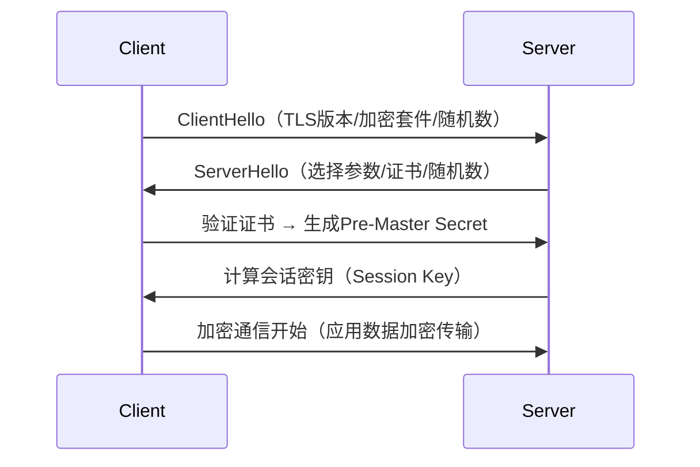

### HTTP/HTTPS 底层原理详解（2025年5月更新）

---

#### 一、HTTP协议原理
##### 1. **核心架构**
HTTP是基于TCP/IP协议栈的应用层协议，采用**客户端-服务器模型**，通过文本报文实现通信。其核心特性包括：
- **无状态性**：每个请求独立处理，服务器不保留会话信息（需通过Cookie/Session扩展实现状态）
- **请求-响应模型**：客户端主动发起请求，服务器被动响应
- **文本协议**：报文头为ASCII编码，正文支持任意二进制数据

##### 2. **通信流程**


- **三次握手**：建立TCP连接（SYN同步序列号 → SYN-ACK确认 → ACK最终确认）
- **请求结构**：
  ```http
  GET /index.html HTTP/1.1
  Host: example.com
  User-Agent: Mozilla/5.0
  ```
- **响应结构**：
  ```http
  HTTP/1.1 200 OK
  Content-Type: text/html
  Content-Length: 1274
  
  <!DOCTYPE html>...
  ```
- **四次挥手**：释放TCP连接资源

##### 3. **关键机制**
- **持久连接（HTTP/1.1 Keep-Alive）**：复用TCP连接传输多个请求，减少握手延迟
- **分块传输编码（Chunked Encoding）**：动态内容无需预知长度，支持流式传输
- **状态码体系**：
  | 类别 | 典型状态码 | 含义             |
  |------|------------|------------------|
  | 2xx  | 200        | 成功             |
  | 3xx  | 301        | 永久重定向       |
  | 4xx  | 404        | 资源未找到       |
  | 5xx  | 500        | 服务器内部错误   | 

---

#### 二、HTTPS协议原理
##### 1. **安全架构**
HTTPS = HTTP + SSL/TLS加密层，通过以下机制保障安全：
- **数据加密**：混合加密（非对称加密交换密钥 + 对称加密传输数据）
- **身份验证**：数字证书验证服务器身份
- **完整性校验**：MAC（消息认证码）防止数据篡改

##### 2. **TLS握手过程**


- **证书验证**：客户端验证CA签发的服务器证书合法性（有效期、颁发机构等）
- **密钥交换**：ECDHE/RSA算法生成会话密钥
- **前向保密**：会话密钥仅用于当前连接，防止历史数据解密

##### 3. **加密机制对比**
| 类型         | 算法示例       | 用途               | 性能   |
|--------------|----------------|--------------------|--------|
| 非对称加密   | RSA/ECC        | 密钥交换/身份认证  | 低     |
| 对称加密     | AES-256/ChaCha20| 数据加密           | 高     |
| 哈希算法     | SHA-256        | 完整性校验         | -      |

---

#### 三、成熟开发库推荐
##### 1. **C/C++库**
| 库名称       | 特点                          | 适用场景          | 参考来源       |
|--------------|-------------------------------|-------------------|----------------|
| **libcurl**  | 支持多协议/跨平台/SSL集成     | 通用HTTP客户端    |      |
| **Boost.Beast** | 纯C++实现/基于Asio异步模型    | 高性能服务器开发  |        |
| **OpenSSL**  | 底层加密/证书管理              | TLS协议实现       |      |

##### 2. **Python库**
| 库名称       | 特点                          |
|--------------|-------------------------------|
| **Requests** | 人类友好API/自动处理Cookies    |
| **aiohttp** | 异步支持/高性能爬虫开发        |

##### 3. **其他语言**
- **Java**: OkHttp / Apache HttpClient
- **JavaScript**: Axios / Node.js `http`模块

---

#### 四、扩展知识
- **HTTP/2特性**：二进制分帧/头部压缩/多路复用
- **HTTP/3革新**：基于QUIC协议（UDP实现低延迟）
- **性能优化技巧**：
  - 启用HTTP/2服务端推送
  - 使用CDN加速静态资源
  - 配置OCSP Stapling减少证书验证延迟

---

**文档保存建议**：建议将本文与RFC 7230（HTTP/1.1）、RFC 8446（TLS 1.3）规范结合阅读，深入理解协议细节。