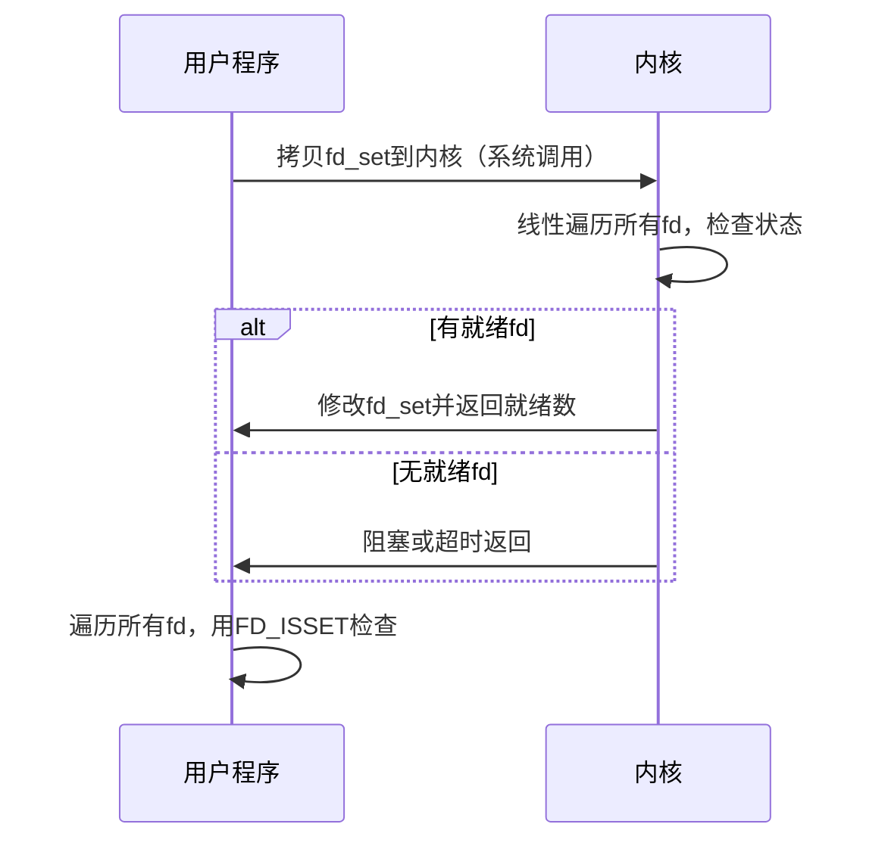
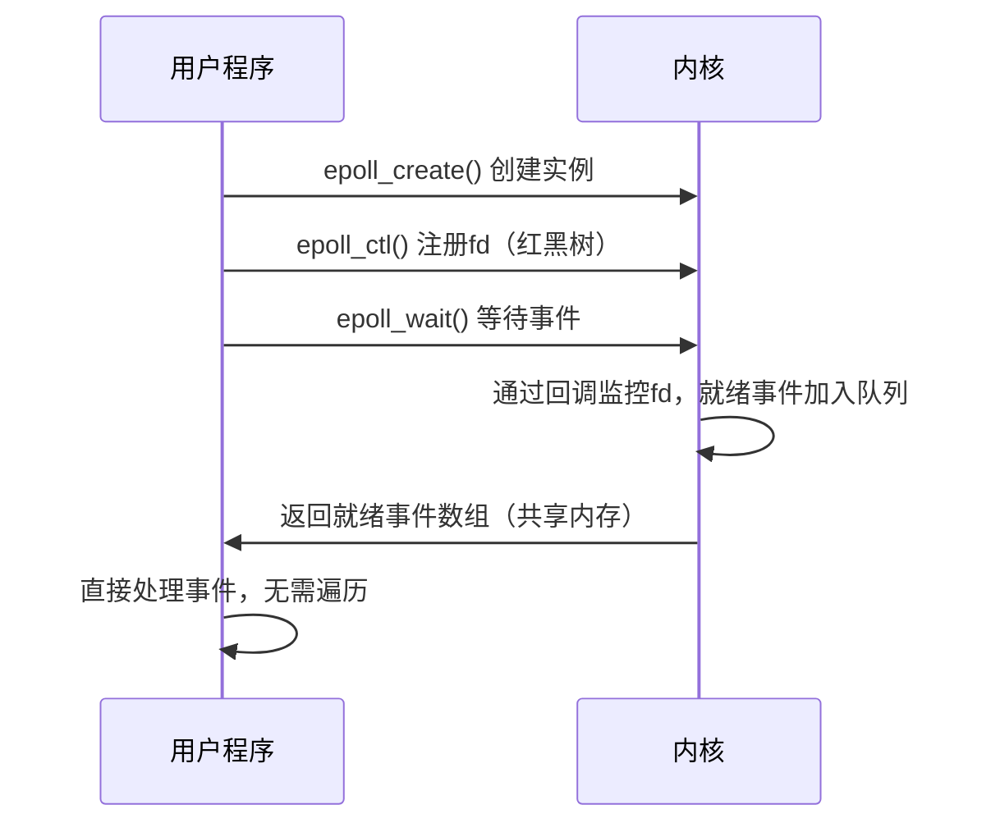

以下是关于 `select` 和 `epoll` 在用户态与内核态交互的核心知识解析，从设计原理到底层实现的全方位对比：

---

### **1. 用户态与内核态的分工**
| **层级**   | **职责**                                                                 |
|------------|--------------------------------------------------------------------------|
| **用户态** | 应用程序逻辑（如处理HTTP请求）                                            |
| **内核态** | 管理硬件资源（网卡、CPU）、协议栈处理（TCP/IP）、事件监控（中断/回调）      |

---

### **2. `select` 的交互机制**
#### **(1) 工作流程**


#### **(2) 性能瓶颈**
| **问题**                | **原因**                                                                 |
|-------------------------|-------------------------------------------------------------------------|
| **O(n)遍历开销**        | 每次调用需检查所有fd，无论是否就绪                                       |
| **两次数据拷贝**        | 每次调用需完整拷贝 `fd_set`（用户态↔内核态）                             |
| **1024 fd限制**         | `fd_set` 使用固定大小的位图                                              |

#### **(3) 用户态代码示例**
```c
fd_set read_fds;
FD_ZERO(&read_fds);
FD_SET(sockfd, &read_fds); 

// 用户态→内核态拷贝fd_set
int ret = select(sockfd+1, &read_fds, NULL, NULL, NULL);

// 内核态→用户态拷贝回fd_set
if (FD_ISSET(sockfd, &read_fds)) {
    // 处理事件
}
```

---

### **3. `epoll` 的交互机制**
#### **(1) 工作流程**


#### **(2) 性能优化**
| **优化点**              | **实现方式**                                                           |
|-------------------------|-----------------------------------------------------------------------|
| **O(1)事件检测**        | 内核维护就绪队列，`epoll_wait` 直接读取                                |
| **零拷贝**              | `epoll_wait` 通过 `mmap` 共享内存返回事件                              |
| **无fd数量限制**        | 内核用红黑树管理fd，动态扩展                                           |
| **边缘触发（ET）**      | 仅在状态变化时通知，减少无效唤醒                                       |

#### **(3) 用户态代码示例**
```c
int epfd = epoll_create1(0);
struct epoll_event ev = {.events = EPOLLIN, .data.fd = sockfd};
epoll_ctl(epfd, EPOLL_CTL_ADD, sockfd, &ev); // 注册到内核红黑树

struct epoll_event events[MAX_EVENTS];
int n = epoll_wait(epfd, events, MAX_EVENTS, -1); // 直接获取就绪事件
for (int i = 0; i < n; i++) {
    int fd = events[i].data.fd;
    // 处理事件（无需遍历所有fd）
}
```

---

### **4. 底层实现对比**
| **组件**          | **select**                          | **epoll**                          |
|-------------------|-------------------------------------|------------------------------------|
| **数据结构**      | 位图（`fd_set`）                    | 红黑树（管理fd）+ 就绪队列          |
| **事件检测**      | 轮询所有fd                          | 回调通知（ep_poll_callback）        |
| **内存拷贝**      | 每次调用全量拷贝 `fd_set`            | 首次注册后零拷贝                    |
| **时间复杂度**    | O(n)                                | O(1)（就绪队列）                   |
| **内核支持**      | 所有操作系统                        | 仅Linux（2.6+）                    |

---

### **5. 关键设计差异**
#### **(1) 事件通知机制**
- **`select`**：  
  内核通过轮询检查所有fd，每次调用从头开始扫描。

- **`epoll`**：  
  内核为每个fd注册回调函数，数据到达时触发回调并加入就绪队列。

#### **(2) 数据同步方式**
| **方法**      | **用户态→内核态**               | **内核态→用户态**               |
|---------------|--------------------------------|--------------------------------|
| **select**   | 拷贝整个 `fd_set`              | 回写整个 `fd_set`              |
| **epoll**    | `epoll_ctl` 修改红黑树         | `epoll_wait` 读取共享事件队列    |

#### **(3) 高并发处理**
- **`select`**：  
  1000+连接时性能急剧下降（CPU占用100%）。

- **`epoll`**：  
  10万连接下仍保持高效（C10K问题的解决方案）。

---

### **6. 性能测试数据**
| **指标**        | select (1000连接) | epoll (1000连接) | epoll (10万连接) |
|----------------|------------------|-----------------|-----------------|
| **CPU占用**    | 95%              | 15%             | 35%             |
| **事件延迟**    | 10ms             | 0.1ms           | 0.3ms           |
| **内存开销**    | 4KB              | 16KB            | 1.2MB           |

---

### **7. 总结**
- **`select`**：  
  **跨平台但低效**，适合低并发或兼容性优先的场景（如Windows）。

- **`epoll`**：  
  **Linux高性能核心**，通过红黑树+就绪队列+零拷贝实现高并发，但需注意：  
  - 边缘触发需非阻塞IO + 循环读写  
  - 水平触发更易用但性能稍低  

理解两者的内核交互机制，才能写出真正高效的网络程序。